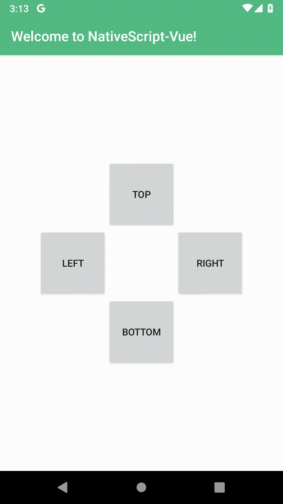

# NativeScript-Vue Multi Drawer

A plugin which provides a drawer component that supports multiple drawers.



All drawers are optional, and can be configured individually.

Features:
 * drawers on left, right, top and bottom
 * swipe to open
 * swipe to close
 * tap outside to close
 * progressively dim main content as the drawer is opened
 
 ## Quick Start
 
 ```bash
$ npm i --save nativescript-vue-multi-drawer
 ```
 

```diff
// main.js
import Vue from 'nativescript-vue'
...
+ import MultiDrawer from 'nativescript-vue-multi-drawer'
+ Vue.use(MultiDrawer)
```

Optionally set default options by passing `options` when installing the plugin:
```js
Vue.use(MultiDrawer, { 
  // override any option here
  // for example enable debug mode
  debug: true
})
```

For the available options check [the source of defaultOptions](https://github.com/nativescript-vue/nativescript-vue-multi-drawer/blob/98df9f4d342ebae12c761e45f4f23f68c15fb094/index.js#L5-L76)

```xml
<MultiDrawer>
  <StackLayout slot="left">
    <Label text="Im in the left drawer" />  
  </StackLayout>
  <StackLayout slot="right">
    <Label text="Im in the right drawer" />  
  </StackLayout>
  <StackLayout slot="top">
    <Label text="Im in the top drawer" />  
  </StackLayout>
  <StackLayout slot="bottom">
    <Label text="Im in the bottom drawer" />  
  </StackLayout>
  
  <Frame /> <!-- main content goes into the default slot -->
</MultiDrawer>
```

The component will only enable drawers that have contents in them, so if you only need a left and a right side drawer, you can just remove the top and bottom slots and it will work as expected.

